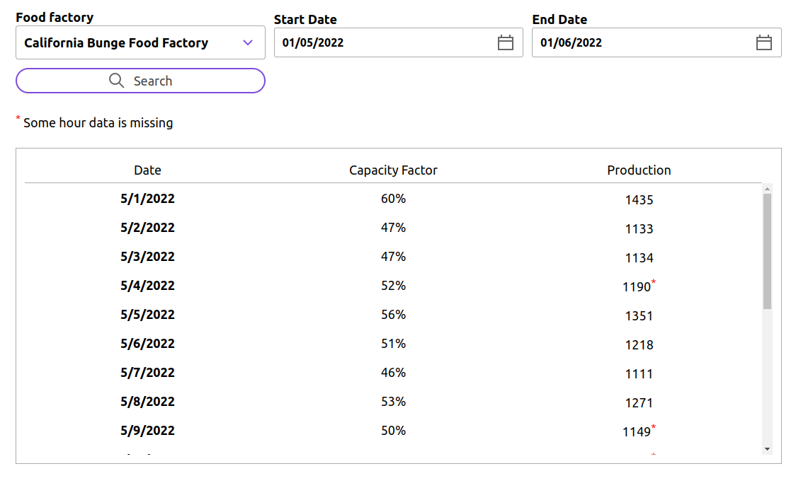

# Factory Productivity Service

## Introduction
It is a simple service for the query of daily production and capacity factor of factories.

The service exposes the following REST APIs for data queries:

**1. Retrieve a list of factories by type**

`GET /factories?type={resource-type}`

**2. Retrieve a list of daily production for a specific factory** 

`GET /factories/{factory-id}/daily-production?startDate={start-date}&endDate={end-date}`


## Technology Stack
This repository provides the source code of both front-end and backend.
### Front-end
The front-end application is built based on [React JS Starter](https://create-react-app.dev/) which offers a quick way to create a application template for development.
- [React JS](https://reactjs.org/)
- [React Redux](https://react-redux.js.org/)
- [Grommet UI component](https://www.grommet.io/)

### Backend
This service is built using **Spring Reactive Stack** which is a non-blocking web framework. In order to ensure end-to-end non-blocking process, database access is implemented using **Spring Data R2DBC**.
- Java 11
- [Spring Reactive Stack](https://spring.io/reactive)
- [Spring Data R2DBC](https://spring.io/projects/spring-data-r2dbc)

Non-blocking technology performs better in an environment of high request volume. Refer to [this article](https://blog.devgenius.io/is-spring-webflux-a-myth-4526c2f92413), you can find the load test results which show the difference between Spring Servlet and Spring Webflux.

## Build & Run
To build and run this service, you need to have **Maven** and **Docker** installed on your local machine. The service runs on Java 11.

The maven project consists of 2 modules:
- **factory-production-front-end** - Front-end of the factory service
- **factory-production-service** - factory service

### Build
Run this command to build the source code of both front-end and backend service.
```shell
mvn clean install
```

### Run the service
Since this service depends on a database, bring up a PostgreSQL database in Docker container. 

Docker compose definition is provided in resources folder, change directory to the `docker-compose` folder and start up the docker stack:
```shell
cd resources/docker-compose
docker compose up
```

PostgreSQL database will be started with 3 factories and around 30k hourly production records 

Then, change directory to the core source code folder and run the service:
```shell
cd factory-production-service
mvn spring-boot:run
```

Go to `http://localhost:8080` on a browser, you will see the front-end screen. Sample data is available in the date range between 2021-01-01 and 2022-05-23. Feel free to play around. 




### Explore API usage
If you would like to test the API using postman, import the postman script from folder `resources/postman`:
- `factory-production.postman_collection.json` - API requests
- `Local.postman_environment.json` - Environment variables

After the import, set the current environment to be "**Local**" 

You will see a request collection "factory-production" with a set of API requests:
- **Get Toy Factories** - retrieve list of toy factories
- **Get Food Factories** - retrieve list of food factories
- **Daily Production** - retrieve list of daily production for a specific food factories
- **Daily Production DST Transition 1** - retrieve list of daily production with a date range that overlaps with day-light saving time start (clock forward)
- **Daily Production DST Transition 2** - retrieve list of daily production with a date range that overlaps with day-light saving time end (clock backward)


## Data Model
Data model consists of 2 entities - factory and hourly production.


- **Factory**
  - represent a factory with `id` attribute as the primary key in the format of `uuid` 
  - With `type` attribute, the data model is flexible for different type of factories such as food factories, toy factories, etc

- **Hourly Production** 
  - store the hourly production of factories
  - primary key is a surrogate key with auto increment
  - foreign key constraint of factory id ensures data integrity because only hourly production data of known factory id can be inserted into the table
  - `start_hour` attribute is the start time of hourly production. For example, start_hour = '2022-01-15 09:00:00' is for the production of 09:00 - 10:00 on 2022-01-15
  - `start_hour` is in the format of timestamp with time zone. It supports the readings submitted from factory in its local time. When record is inserted into PostgreSQL, it converts timestamp with the given timezone and store internally in UTC
  - Assume no duplicated record, it is supposed that the data feed is de-duplicated and transformed to be in a consumable format as the readings are collected from factories

## Front-end System Design
- The front-end is based on React Redux framework. Any change on data is triggered by an action and reducer is responsible for updating in the data store.
- The action of asynchronized API calls is implemented using Redux middleware Thunk
- The front-end consists of 2 UI components - **SearchBar** and **ResultTable** for the query submission and result display respectively 

## Backend System Design
The service component is based on a typical structure of `controller-service-repository`:
- **Controller** - exposes REST API endpoints, convert and validate requests and return HTTP response
- **Service** - execute the main system logic flow. It invokes other services and repositories if necessary
- **Repository** - provide an integration layer for database access. It is responsible for the execution of SQL statements. The repositories are built using Spring Data R2DBC which simplifies the implementation  


### Timezone
- In order to support the timezone offset and day-light saving, the format of timezone should follow IANA timezone database (e.g. America/Los_Angeles) instead of hour offset (e.g. -07:00)
- Date time field `start_hour` of **Hourly Production** table is converted to UTC for internal storage in database

### Aggregated Daily Production
- The logic of daily production aggregation relies on this SQL statement which handles the time zone offset and day-light saving
```roomsql
SELECT 
DATE_TRUNC('day', start_hour at time zone :timezone) AS date,
COUNT(id) AS count,
sum(production) AS production
FROM hourly_production 
WHERE factory_id = :factoryId 
AND DATE_TRUNC('day', start_hour at time zone :timezone) >= :startDate::date 
AND DATE_TRUNC('day', start_hour at time zone :timezone) <= :endDate::date 
GROUP BY DATE_TRUNC('day', start_hour at time zone :timezone)
ORDER BY date ASC
```
- The logic above is a quick & simple solution approach assuming the performance of database powerful enough to handle the peak volume. 
- If request volume grows drastically and database becomes a performance bottleneck, then the suggested solution approach is to migrate the data aggregation logic from SQL statement to service component. Although this approach involves more complicated logic in Java, service can be easily scaled up horizontally
- **Factory Service** calculates the capacity factor and determine whether any data missing by checking the count and the date of day-light saving transition


